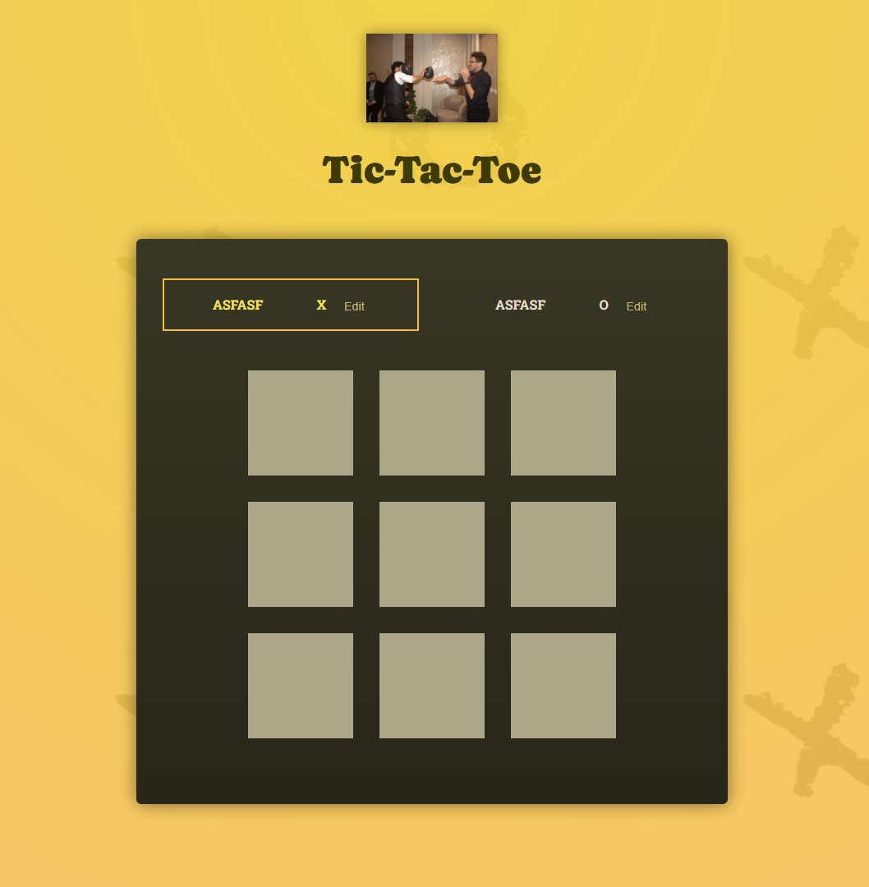

# Tic-Tac-Toe Game

A modern, interactive tic-tac-toe game built with React and Vite. Features customizable player names, move history logging, and a clean, responsive interface.



## Features

- **Two-Player Game**: Play against a friend with alternating turns
- **Customizable Player Names**: Edit player names with inline editing
- **Move History**: Track all moves with a detailed log
- **Win Detection**: Automatic detection of winning combinations
- **Draw Detection**: Handles tied games gracefully
- **Restart Functionality**: Start a new game anytime
- **Responsive Design**: Works on desktop and mobile devices
- **Keyboard Support**: Press Enter to save player name changes

## Getting Started

### Prerequisites

- Node.js (version 14 or higher)
- npm or yarn package manager

### Installation

1. Clone the repository:

```bash
git clone <repository-url>
cd tic-tac-toe-game
```

2. Install dependencies:

```bash
npm install
```

3. Start the development server:

```bash
npm run dev
```

4. Open your browser and navigate to `http://localhost:5173`

## How to Play

1. **Start the Game**: The game begins with Player 1 (X) as the active player
2. **Make Moves**: Click on any empty square to place your symbol
3. **Customize Names**: Click "Edit" next to a player name to customize it
4. **Win the Game**: Get three of your symbols in a row (horizontal, vertical, or diagonal)
5. **View History**: Check the move log on the right side to see all previous moves
6. **Restart**: Click "Rematch!" after a game ends to start fresh

## Available Scripts

- `npm run dev` - Start the development server
- `npm run build` - Build the project for production
- `npm run preview` - Preview the production build
- `npm run lint` - Run ESLint to check for code issues

## Project Structure

```
src/
├── components/
│   ├── GameBoard.jsx      # Game board component with clickable squares
│   ├── GameOver.jsx       # Game over modal with winner/draw message
│   ├── Log.jsx           # Move history log component
│   └── Player.jsx        # Player component with name editing
├── App.jsx               # Main application component
├── index.jsx             # Application entry point
├── index.css             # Global styles
└── winning-combinations.js # Game logic for win detection
```

## Key Features Explained

### Player Name Customization

- Click the "Edit" button next to any player name
- Type the new name and press Enter or click "Save"
- Names are updated in real-time throughout the game

### Move Logging

- Every move is tracked with player name and coordinates
- Log shows the most recent moves at the top
- Helps players keep track of game progression

### Win Detection

- Checks all possible winning combinations (8 total)
- Automatically detects wins and draws
- Displays appropriate game over message

## Technical Details

- **Framework**: React 19.0.0
- **Build Tool**: Vite 4.4.5
- **Styling**: CSS with modern features
- **State Management**: React hooks (useState)
- **Code Quality**: ESLint with React-specific rules

## Game Logic

The game uses a derived state pattern where:

- Game board state is derived from the turn history
- Active player is determined by the last move
- Winner is calculated by checking all winning combinations
- Game state is managed through React's useState hook

## Contributing

1. Fork the repository
2. Create a feature branch (`git checkout -b feature/amazing-feature`)
3. Commit your changes (`git commit -m 'Add some amazing feature'`)
4. Push to the branch (`git push origin feature/amazing-feature`)
5. Open a Pull Request

## Acknowledgments

- Built as part of a React course project
- Inspired by classic tic-tac-toe gameplay
- Thanks to the React community for excellent documentation and tools

---

**Enjoy playing Tic-Tac-Toe!**
